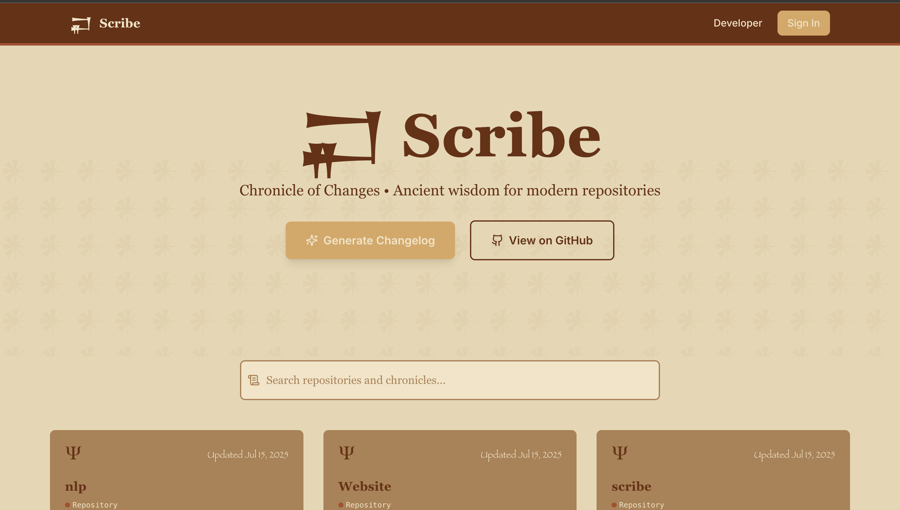

```bash
# welcome to muhammad yousuf's portfolio

> status: online
> role: software engineer
> location: new york metropolitan area
> interests: distributed-systems, machine-learning, acceleration

$ ./launch_portfolio.sh
```

---

# Muhammad Yousuf

📍 New York Metropolitan Area
📧 [muhammad.y.2305@gmail.com](mailto:muhammad.y.2305@gmail.com)
🔗 [LinkedIn](https://www.linkedin.com/in/muhammadyousufii/) | [GitHub](https://github.com/MYousuf3)

---

## About Me

I am a software engineer passionate about building scalable systems, machine learning applications, and developer-focused tools. With experience at companies like Meta, John Deere, and Johnson & Johnson, I have worked on projects spanning distributed systems, financial forecasting, and healthcare data engineering. Currently pursuing a BS/MS in Computer Science at Georgia Tech with a perfect GPA, I strive to merge strong fundamentals with hands-on impact. Beyond work, I enjoy problem solving, HPC, and innovative side projects.

---

## Experience

### Meta — Software Engineering Intern (May 2025 – Aug 2025)

Menlo Park, CA
<div style="text-align:center">
    
</div>

* Developed verification tool for MTIA Graph Compiler Inductor backend, integrated into PyTorch for automated runtime/accuracy testing.
* Implemented telemetry data serialization and caching, reducing verification runtime by 30%.
* Improved operator coverage by 4% and reduced compilation time by 10% through C++ Pybinds and compiler optimizations.

---

### John Deere Financial — Software & Data Engineering Intern (May 2024 – Aug 2024)

Johnston, IA
<div style="text-align:center">
    
</div>

* Built Asset Valuation Index spanning 10 years using Spark & Databricks.
* Integrated LightGBM/XGBoost projection models for 18-month economic forecasting.
* Automated dataflows with R scripts and PySpark seasonality algorithm, improving stability by 34%.

---

### Johnson & Johnson — Software & Data Engineering Intern (May 2023 – Aug 2023)

Raritan, NJ
<div style="text-align:center">
    
</div>

* Developed Python models for EBR manufacturing process in CAR-T cancer therapy.
* Proposed workflow improvements reducing shift processing bottlenecks.
* Created a React + Azure GUI for work shift assignments, improving speed and efficiency.

---

## Projects

### [RL Wordle (2025)](https://github.com/MYousuf3/wordle-rl)
<div style="text-align:center">
    
</div>

```python
# solving wordle with reinforcement learning
algorithms = ["Naïve Bayes", "Monte Carlo Tree Search", "Q-Learning"]

q_agent = QLearningAgent(train_games=1_000_000, strategy="epsilon-greedy")
win_rate = q_agent.evaluate()

print(f"RL Wordle Agent Win Rate: {win_rate}%")  # 97%
```

* Achieved a **97% win rate** with Q-Learning agent.
* Parallelized 1M+ simulations on Georgia Tech’s PACE HPC cluster with CUDA kernels.
* Built an interactive React demo for predictions and metrics.

---

### [Scribe (2025)](https://github.com/MYousuf3/scribe)
<div style="text-align:center">
    
</div>
```javascript
// automatic changelog generation
const changelog = generateChangelog(commits);
deployTo("Vercel");

console.log("✅ Release notes updated!");
```

* Full-stack platform for automated changelog generation.
* Next.js frontend + MongoDB + REST API backend.
* GitHub OAuth + advanced editing/search for dynamic release management.

---

## Research

### Undergraduate Research Assistant — AI Virtual Assistant Lab (Jan 2025 – Present)

Atlanta, GA

```cpp
// Linear Quadratic Model Predictive Control
LQMPC controller;
controller.optimize();
deploy(controller, real_time_system);
```

* Ported LQ-MPC optimization library from Python → C++ for faster runtime.
* Contributed to dataset paper for efficient LLM tuning in research paper conversation tasks.

---

## Skills

```bash
# languages
java python c c++ sql node.js pyspark javascript react html/css php typescript bash  

# frameworks & tools
pytorch docker aws spark kafka flask spring mongodb tensorflow kubernetes git ci/cd  

# domains
distributed-systems machine-learning cloud-computing backend-dev data-engineering
```

---

## Contact

```yaml
name: Muhammad Yousuf
email: muhammad.y.2305@gmail.com
linkedin: linkedin.com/in/muhammadyousufii
github: github.com/MYousuf3
```

---

## Resume

📄 [View My Resume](MYousufResume27.pdf)
